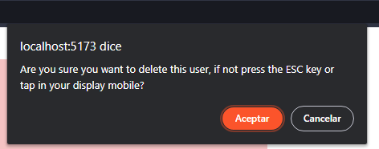

# Proyecto Monograph Dashboard

Proyecto Vue.js para gestionar y visualizar datos de una API externa (en este caso, https://randomuser.me) mediante un sistema de inicio de sesión. Este proyecto brinda acceso a los usuarios para explorar y examinar los datos proporcionados por la API externa.

Credenciales login
Usuario
```sh
Eglobal
```
Password
```sh
Eglobal
```

## Tabla de Contenidos

- [Instalación](#instalación)
- [Uso](#uso)
- [Ejemplos](#ejemplos)
- [Contribucion](#Contribución)
- [Créditos](#créditos)
- [Licencia](#licencia)
- [Contacto](#contacto)

## Instalación

Sigue estos pasos para instalar y ejecutar la aplicación:

1. Clonar el proyecto 
```sh
git clone https://github.com/Abic26/Prueba_Tecnica_Eglobal.git
```
2. Seleccione donde descargo el proyecto:
```sh
cd ejemplo/ejemplo
```
3. Instala las dependencias:
```sh
npm install
```
4. Abrir el proyecto en el editor de código de preferencia, se recomienda Vsc (Visual Studio Code):
```sh
code .
```
5. inicializa el proyecto en local
```sh
npm run dev
```
## Uso

1. Al inicializar el proyecto en local ingresaras a la pagina principal.


2. luego ingresaras al login para validar tus credenciales e ingresar a la tabla Api.
Credenciales login
Usuario
```sh
Eglobal
```
Password
```sh
Eglobal
```


3. Ingresaras a la tabla de datos donde podrá observar los datos de la api externa (en este caso, https://randomuser.me)


4. podrás manejar los datos con esta tabla, tienes varias funciones la cual va a poder utilizar e interactuar con la tabla

### Filtrar

Haz click en el botón de seleccionar y escoja la opción deseada para filtrar:


### Actualizacion

Haz click en el botón Update para actualizar los datos de los usuarios e ingresa los nuevos datos:


### Eliminar

Haz click en el botón Delete para Eliminar el usuario no deseado y realice la accion que quiere tomar, si eliminar o no:



### Cargar nuevos usuarios

Haz click en el botón Change Users para actualizar los usuarios de la tabla


## Contribución

Cómo contribuir al proyecto.
1. Clonar el proyecto:
```sh
git clone https://github.com/Abic26/Prueba_Tecnica_Eglobal.git
```
2. Crea una rama para la contribución: 
```sh
git checkout -b feature/nueva-funcionalidad
```
3. Realice sus cambios y realiza los commits: 
```sh
git add .
git commit -m "Agrega nueva funcionalidad"
```
4. Realize push con sus nuevos cambios: 
```sh
git push origin feature/nueva-funcionalidad
```

## Créditos

Este proyecto fue creado por [Andres Felipe Lopez S. "Abic26"](https://github.com/Abic26).

## Licencia

Este proyecto está bajo la Licencia MIT, lo que significa que puedes:

- Usar el código en tus proyectos personales o comerciales.
- Modificar el código para satisfacer tus necesidades.
- Distribuir el código modificado o sin modificar.
- Incluir el código en otros proyectos (con los atributos adecuados).

**¡No tienes que pedir permiso!** Solo asegúrate de incluir el aviso de derechos de autor y la declaración de la Licencia MIT en las copias de tu proyecto.

## Contacto

Si tienes preguntas, sugerencias o comentarios sobre este proyecto, no dudes en ponerte en contacto. Puedes visitarme a través de:

- Correo electrónico: [contacto@example.com](mailto:contacto@example.com)
- Sitio web: [Abic26_github_page](https://abic26.github.io/Cv_Andres_Lopez/)

¡Espero escuchar tus pensamientos y opiniones!


